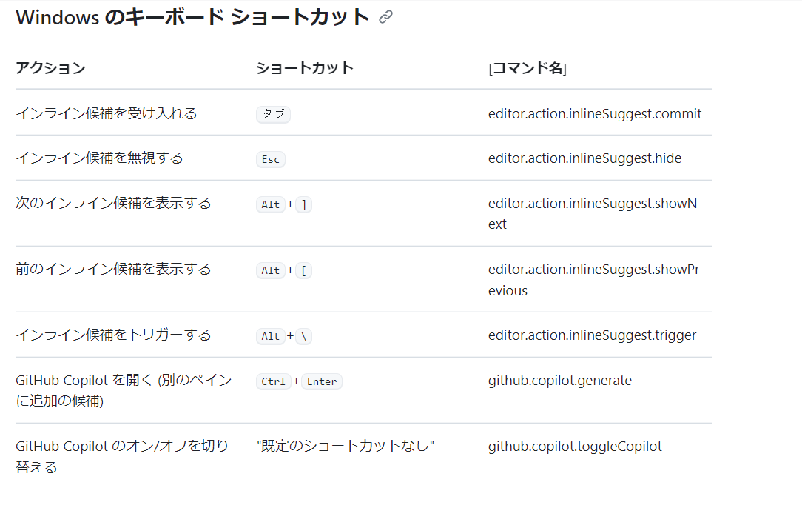

# Github copilotの基本的な使い方の

VSCodeに拡張機能として入れて頂いていますが、なんとなくで使用していて使いこなしてる感じがしなかったので調査してみました。

### 参考にした資料
[Github Copilot拡張](https://marketplace.visualstudio.com/items?itemName=GitHub.copilot-chat)
[Github Copilot in VS Code](https://code.visualstudio.com/docs/copilot/overview)

## memo

[Github Copilot in VS Codeの動画の中で紹介されてたこと](https://code.visualstudio.com/docs/copilot/overview)
1. 補完で出てくる候補の文字列は「ゴーストテキスト(GHOST TEXT)」と呼ぶらしい。
2. copilotが有効になっているかどうかや、無効化の設定についてはＶＳコード下部のアイコンから開けるメニューで調整できる。
3. 補完を受け入れるなら Tab
3. 補完を部分的に受け入れるなら Ctrl + →  (mac. cmd + →)
4. Ctrl + Enterを押すとサイドパネルで代替案を表示する。
5. Ctrl + i (mac. cmd + i)でインラインチャットを開く。
6. チャットサイドバーは場所移動できる。
7. インラインチャットとゴーストテキストは実装を高速化し、チャットサイドバーは意思決定を高速化する。(いろいろ提案してもらったものから取捨選択するので、検索より早い場合もある。)
8. チャットサイドバーは履歴を表示したり、別のウインドウで開きなおしたりできる。

### vscodeで利用できるショートカット
[利用できるショートカット（公式）](https://docs.github.com/ja/copilot/managing-copilot/configure-personal-settings/configuring-github-copilot-in-your-environment)

### 
